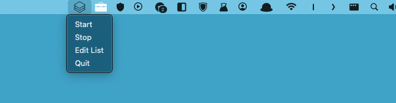

# AutoOrganizer

AutoOrganizer is a Python application that automatically organizes your downloaded files into folders based on file extensions. Simply specify the file extensions you want to organize, and AutoOrganizer will move the files to the appropriate folders within your designated destination folder.



## Features

- Automatically organizes files based on specified file extensions.
- User-friendly interface.
- Customizable file extension list.
- Real-time monitoring of the download folder.

  ## Getting Started

### Prerequisites

- Python 3.x
- macOS operating system (tested on macOS, might work on other Unix-like systems)

### Installation

1. **Clone the repository:**

   ```bash
   git clone <repository-url>
   cd AutoOrganizer
   ```

2. **Install required Python packages:**

   ```bash
   pip install -r requirements.txt
   ```

3. **Run the application:**

   ```bash
   nohup python main.py &
   ```

## Usage

1. Launch the application by running `main.py`.
2. Click on "Edit List" to modify the list of file extensions you want to organize.
3. Click on "Start" to begin monitoring the download folder and organize incoming files.
4. Click on "Stop" to stop monitoring the folder.

## Configuration

- **Folder to Track**: The folder where downloaded files are stored. Default is the user's Downloads folder.
- **Destination Folder**: The folder where organized files will be moved. Default is a folder named "organized_files" within the user's home directory.
- **Special Extensions File**: The file where you can specify the file extensions to be organized. Each extension should be on a separate line in lowercase.

## License

This project is licensed under the [MIT License](LICENSE).

## Acknowledgements

- [rumps](https://github.com/jaredks/rumps) - Python library for creating interactive menus and notifications in macOS status bar.
- [watchdog](https://github.com/gorakhargosh/watchdog) - Python library for monitoring file system events.
